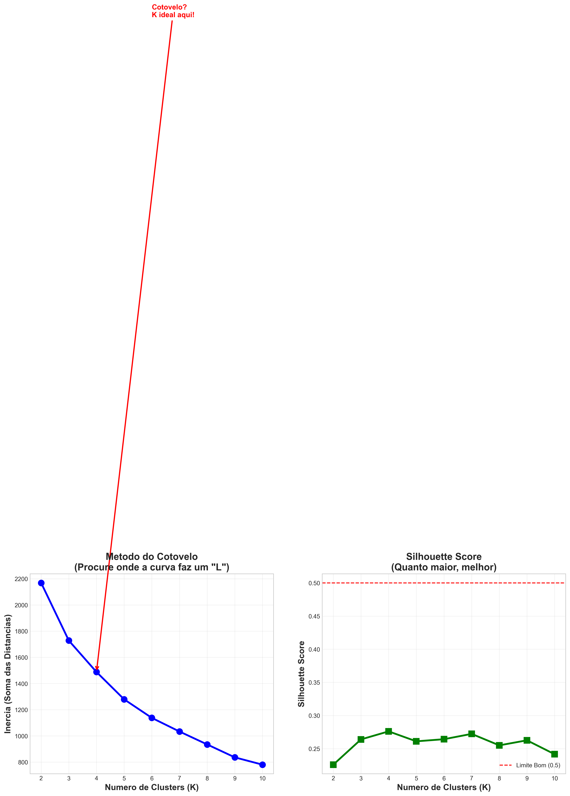
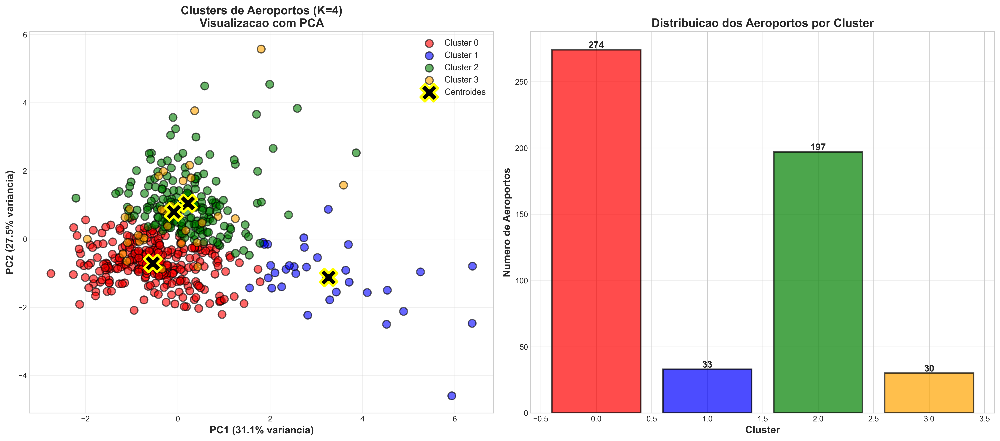
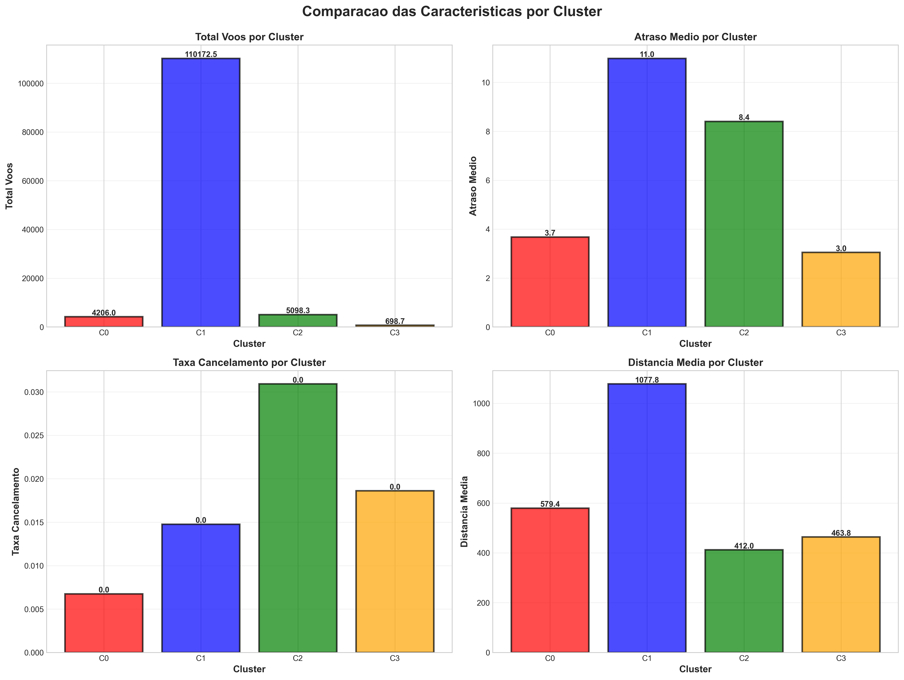

# Clustering de aeroportos — exemplo visual

Demonstração didática de **aprendizado não supervisionado** aplicada a dados de voos: agrupa aeroportos por perfil operacional (volume, atrasos, cancelamentos, etc.), reduz dimensões com **PCA** e gera gráficos em alta resolução.

O pipeline está implementado em [`exemplo_clustering_visual.py`](exemplo_clustering_visual.py).

## Passos do script

As mensagens `PASSO 1` … `PASSO 10` aparecem no terminal ao executar o arquivo. Resumo alinhado ao código:

| Passo | O que acontece |
|-------|----------------|
| **1 — Carregar e preparar os dados** | Lê `flights.csv` e `airports.csv` com pandas e mostra quantidade de voos e de aeroportos. |
| **2 — Criar features por aeroporto** | Agrega por `ORIGIN_AIRPORT`: contagem de voos, média de `DEPARTURE_DELAY`, médias de `CANCELLED`, `DISTANCE` e `DIVERTED`. Mantém só aeroportos com **≥ 100** voos e remove linhas com **NaN**. |
| **3 — Normalizar os dados** | Aplica `StandardScaler` às cinco features (`TOTAL_VOOS`, `ATRASO_MEDIO`, `TAXA_CANCELAMENTO`, `DISTANCIA_MEDIA`, `TAXA_DESVIO`) para nenhuma escala dominar o K-Means. |
| **4 — Número de clusters (método do cotovelo)** | Para cada **K** de 2 a 10, treina K-Means, registra **inércia** e **silhouette score**. Gera o gráfico `images/exemplo_01_elbow_method.png` (cotovelo + silhouette). |
| **5 — Aplicar K-Means** | Usa `optimal_k = 4`, `random_state=42`, `n_init=10`; adiciona a coluna `CLUSTER` e imprime silhouette e distribuição por cluster. |
| **6 — Redução de dimensionalidade (PCA)** | `PCA(n_components=2)` sobre os dados já normalizados; imprime variância explicada por PC1 e PC2. |
| **7 — Visualizar clusters em 2D** | Scatter das amostras e centroides no plano PCA; gráfico de barras da contagem por cluster. Salva `images/exemplo_02_clusters_visualizacao.png`. |
| **8 — Interpretar os clusters** | Para cada cluster, médias nas **escalas originais** (não normalizadas), rótulo automático (ex.: hubs eficientes, regionais pontuais) e exemplos de códigos de aeroporto. |
| **9 — Características por cluster** | Quatro subplots de barras (voos, atraso, cancelamento, distância média). Salva `images/exemplo_03_caracteristicas_clusters.png`. |
| **10 — Insights e conclusões** | Resumo textual, interpretação do silhouette, variância do PCA e recomendações; lista os PNG em `images/`. |

## Requisitos

- Python 3.10+ recomendado  
- Dependências: `pandas`, `numpy`, `matplotlib`, `seaborn`, `scikit-learn`

Instalação:

```bash
pip install -r requirements.txt
```

## Dados necessários

Coloque na **mesma pasta** do script (ou ajuste os caminhos no código):

| Arquivo        | Uso |
|----------------|-----|
| `flights.csv`  | Colunas usadas: `ORIGIN_AIRPORT`, `FLIGHT_NUMBER`, `DEPARTURE_DELAY`, `CANCELLED`, `DISTANCE`, `DIVERTED` |
| `airports.csv` | Carregado no script (base de aeroportos; o foco da agregação é `flights.csv`) |

> Use um dataset de voos compatível com essas colunas (por exemplo, conjuntos públicos de voos nos EUA em formato tabular).

## Como executar

```bash
python exemplo_clustering_visual.py
```

O script imprime cada etapa no terminal e abre janelas do Matplotlib (`plt.show()`). Três imagens PNG são salvas em [`images/`](images/).

### Galeria (para o README no GitHub)

Inclua a pasta `images/` no repositório (faça commit dos `.png` junto com o `README.md`) para as figuras aparecerem na página inicial do projeto no GitHub.







> **Dica:** rode `python exemplo_clustering_visual.py` uma vez com os CSVs no lugar; depois adicione `git add images/*.png` antes do push.

## Saídas geradas

| Arquivo em `images/` | Conteúdo |
|----------------------|----------|
| `exemplo_01_elbow_method.png` | Cotovelo (inércia) e silhouette por K |
| `exemplo_02_clusters_visualizacao.png` | Clusters no plano PCA + barras de contagem por cluster |
| `exemplo_03_caracteristicas_clusters.png` | Comparação de médias por cluster (voos, atraso, cancelamento, distância) |

## Personalização rápida

- **Número de clusters:** altere a variável `optimal_k` (por padrão `4`) após analisar `exemplo_01_elbow_method.png`.
- **Filtro mínimo de voos:** linha com `TOTAL_VOOS >= 100`.
- **Faixa de K no cotovelo:** `K_range = range(2, 11)`.

## Licença

Defina a licença do repositório conforme sua instituição ou preferência (por exemplo MIT, CC-BY ou uso apenas educacional).

---

*Projeto de exemplo para estudo de machine learning / FIAP — módulo de dados.*
